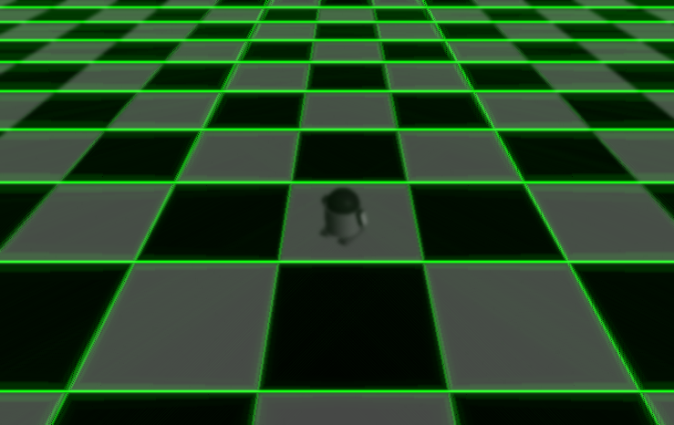

# 第六次作业

### 自动化少61 何奈特 2140506114

注：点击文中的[链接]()查看代码文件
报告中原始未压缩图片较多，加载时间会比较长

---

* 这次作业给了几张PNG和JPG格式的图片，其不是位图，实在是超出我的能力范围，不得不先转成256色位图（使用Adobe Photoshop）。

* 此前几次作业写的BMP类有一个隐藏的问题，在此次的用例中暴露了出来。

旧版的（在BMP256(const char*)、void writeFile(int, int, const char*)等函数中出现）：
```
int dataSizePerLine = ((width + 7) / 8) * 8;
```

这一步是由于每行数据都要8Byte对齐，然而BMP文件应该是4Byte对齐，前几次的用例都是512x512这样的整数，或者133x134这样的凑巧对齐到8的倍数，这个错误一直隐藏着没有发现，在此次的多个用例中才浮现出来（如test4是739x466），体现为读写文件数据有误，出现诡异的黑色斜线。

应改为（详见[bitmap.cpp](bitmap.cpp)）：
```
int dataSizePerLine = ((width + 3) / 4) * 4;
```

* 首先利用空域滤波提取边缘，这里尝试了改进的拉普拉斯和Sobel两种方式，公式分别为：


当然还要进行归一化，详见[hw7.cpp](hw7.cpp)中的void lpls(Bitmap*)和void sobe(Bitmap*)函数。

* Canny法通过恰当的选取双门限可以很好地提取边缘，一般搭配在sobel滤波之后，详见[hw7.cpp](hw7.cpp)中的void cany(Bitmap*, int, int)函数，先将高于高门限的点选出，然后调用递归深度优先搜索扩展选择邻接的（4邻域）高于低门限的点。（为方便起见这里统一选用140和50作为高低门限）

*注：用例和高低门限参数选取刁钻可能会递归爆栈，请手动调整编译器选项*

* 利用上面的三个边缘提取结果，可以进行hough变换进一步提取图中的直线边缘。对于直线方程的两个参数，原图的一条直线对应参数空间的一个点，原图的一个点对应参数空间的一条线，至于线的形状由参数方程形式决定。对最简单的直线方程式ax+by=1，由于参数的值域不定，分布也很不均匀，实际上很难使用。比较好的方式是极坐标形式，可以对直线簇进行等角度、等距离间隔的描述（见下面的草图）


*x坐标的取值范围是0,W-1，y坐标的取值范围是0,H-1*
这样对于点(x,y)可以得到参数空间的一条曲线(y-H/2)cost-(x-W/2)sint=d，其值域很好确定（t为-90度到90度，d不超过√2/4倍的W+H），于是可以遍历每个角度值（本程序隔1度取样，三角函数值可以提前算出并存储，可以加速计算），算出d并四舍五入到邻近的格点，使参数空间中该处的值加上原图中(x,y)点的灰度值。

* 遍历一遍后（总复杂度HxWxD=像素数乘以角度采样数）得到hough空间的二元函数值表，其中的几个极大值点就对应着原图的几条直线边缘。
由于高度离散化提取峰值较困难，这里采用了偷懒的方式：适当增强较大的部分（这里用平方后归一化），然后依权值画出所有点对应的的直线。详见[hw7.cpp](hw7.cpp)中的void hough(Bitmap*)函数。

* 为了直观地表示出直线在原图中的位置，我又向Bitmap类中添加了BMP24（24位真彩色位图）类（详见[bitmap.cpp](bitmap.cpp)），在[show.cpp](show.cpp)中读取前面生成的结果，在原图上叠加绿色的（听说绿色比较醒目）直线边缘，最后得到的结果如下：

*从上到下依次为原图、边缘提取、hough变换、直线边缘、叠加结果*

> test1


拉普拉斯|Sobel|Sobel+Canny
--|--|--
||
||
||
||

> test2


拉普拉斯|Sobel|Sobel+Canny
--|--|--
||
||
||
||

> test3


拉普拉斯|Sobel|Sobel+Canny
--|--|--
||
||
||
||

> test4


拉普拉斯|Sobel|Sobel+Canny
--|--|--
||
||
||
||

> test5


拉普拉斯|Sobel|Sobel+Canny
--|--|--
||
||
||
||

> test6


拉普拉斯|Sobel|Sobel+Canny
--|--|--
||
||
||
||
